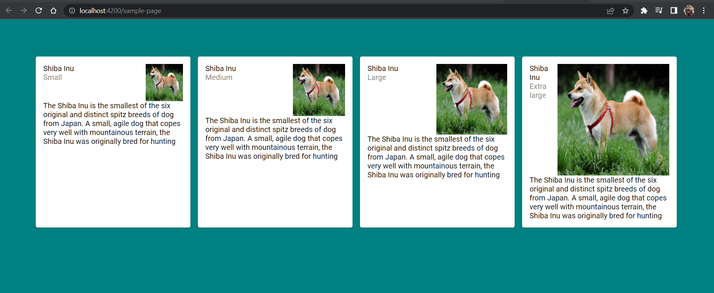

# AngularMaterialNxWorkspace

<a alt="Nx logo" href="https://nx.dev" target="_blank" rel="noreferrer"></a>

✨ **This workspace has been generated by [Nx, a Smart, fast and extensible build system.](https://nx.dev)** ✨


## How to create angular micro-frontend
-Run the following command to create a nx workspace
```
 npx create-nx-workspace@latest 
 ```
-Run the following command to add library dependencies  to the nx workspace 
```
nx g @nx/angular:library --name=common-lib --importPath=@organization/common-lib --style=scss
```
- Configure the script to run the application in package.json 
```
"start:sample-app": "npx nx run sample-app:serve --configuration=development"
```
-- Add angular material dependency 
```
npm add @angular/material
```
-- Add @angular/material in project 
```
npx nx g @angular/material:ng-add --project=common-lib
```
-- Create a shared scss file in common-lib for theming component with angular material
-- add shared scss file url in sample-app project.json 
```
"styles": ["libs/common-lib/styles/app.scss"]
```
-- add @angular/material in sample-app  which will update the app.scss of common-lib by custom theme
```
npx nx g @angular/material:ng-add --project=common-lib
```
-- Generate the material.module file in common-lib


## Start the app

To start the development server run `nx serve sample-app`. Open your browser and navigate to http://localhost:4200/. Happy coding!


## Generate code

If you happen to use Nx plugins, you can leverage code generators that might come with it.

Run `nx list` to get a list of available plugins and whether they have generators. Then run `nx list <plugin-name>` to see what generators are available.

Learn more about [Nx generators on the docs](https://nx.dev/plugin-features/use-code-generators).

## Running tasks

To execute tasks with Nx use the following syntax:

```
nx <target> <project> <...options>
```

You can also run multiple targets:

```
nx run-many -t <target1> <target2>
```

..or add `-p` to filter specific projects

```
nx run-many -t <target1> <target2> -p <proj1> <proj2>
```

Targets can be defined in the `package.json` or `projects.json`. Learn more [in the docs](https://nx.dev/core-features/run-tasks).
